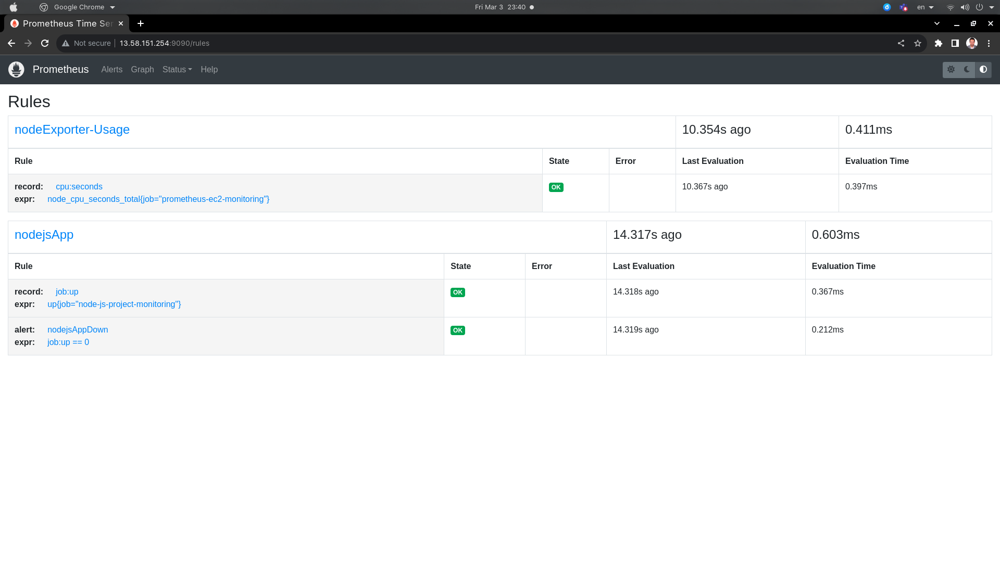

# $${\color{red}Prometheus-and-Grafana}$$	

### A Small project that cover the monitoring of a virtual machine from Amazon `EC2` (Applications, Containers & Resources)

>### Project Components:


>### Requires:

- At first read the PDF file [Prometheus&Grafana]() if you hadn't work with the Prometheus & Grafana before.

- A virtual Machine from [AMAZON](https://aws.amazon.com/console/) --> Create an `EC2 Instance`

- Install Pre-requests, Prometheus, .... and other from the [Full-Demo's](https://github.com/HusseinGhoarba/Prometheus-Grafana/tree/main/Installation-Demos) 

>### Project Gallery  

- EC2 with machine-type `t2-micro`, `Key-Pair`, Image of OS `Ubuntu`, disk storage = `12G` and security group as follows:  


- Allow the next ports in the security groups so that you can access the `Prometheus`, `Alertmanager` & `Grafana`.  


- Open a Terminal and `SSH` to connect to the `EC2`and change the tagged parts of the next command:
```
ssh -i `<add-path/key.pem>` ubuntu@`<Public-IP-of-EC2>`
```


- Install the requires from the [Pre-requests-&-Demo's](https://github.com/HusseinGhoarba/Prometheus-Grafana/tree/main/Installation-Demos) ... After installation we have:
    - `Prometheus` as a service which listen on localhost of the machine on port `9090`
    
    
    - Final Configuration-file-of-prometheus `/etc/prometheus/prometheus.yml`:
    
    
    - `CAdvisor` container for monitoring the containers:
    
    - `node-exporter` as a service:
    
    - Avery simple `nodejs-App` within a file `index.js`:
    
    - `slack` application for `nodeApp-Down-Alert` on a channel:
    
    
    - `rule` quieries:
    
    
    
    - Configuration file of the `alertmanager` `/etc/alertmanager/alertmanager.yml`
    
    - `alertmanager` as a service and it listens on port `9093`:
    
    
    - Enable / run the `nodeApp`: 
    
        - `prometheus` alert section
        
        - `alertmanager`:
        
        - `slack` notification:
        

    - `Grafana` as a service and it listens on port `3000`:
    
    - After adding `Data Source` of the grafana as `Prometheus` and configure dashboards
    
    
    
    